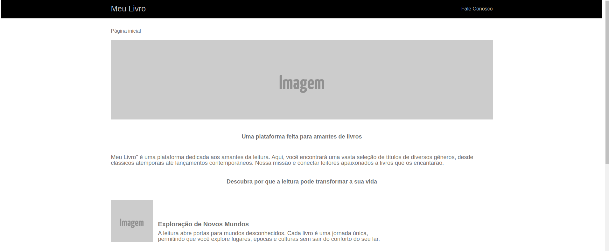

# Meu Livro

## Sobre

Este website, intitulado "Meu Livro", foi desenvolvido com o propósito de aprimorar minhas habilidades. Ele representa uma simulação de um site de comércio de livros e inclui uma página inicial com um banner e imagens de destaque dos livros disponíveis. Além disso, oferece um menu interativo que permite aos usuários acessar a seção "Fale Conosco" e enviar mensagens para a equipe da empresa. Os usuários também têm a opção de retornar à página inicial por meio de um botão à esquerda. Além disso, há uma página chamada "Mensagem Enviada", onde os usuários receberão confirmação de que a mensagem foi enviada com sucesso. Agradeço por ter conferido o meu projeto!

## Tecnologias Utilizadas: 
- HTML5 para estruturação da página.
- CSS3 para estilização da página.

## Protótipo
Projeto foi construido em cima deste projeto: https://xd.adobe.com/view/508910cc-fa60-4fb7-8460-9571b9e9abcb-05da/specs/

## Projeto hospedado e funcionando
Para conferir o projeto em funcionamento, acesse este link: https://joao-pimentel-ifsuldeminas.github.io/meulivro.github.io/

## Como ficou o Resultado
